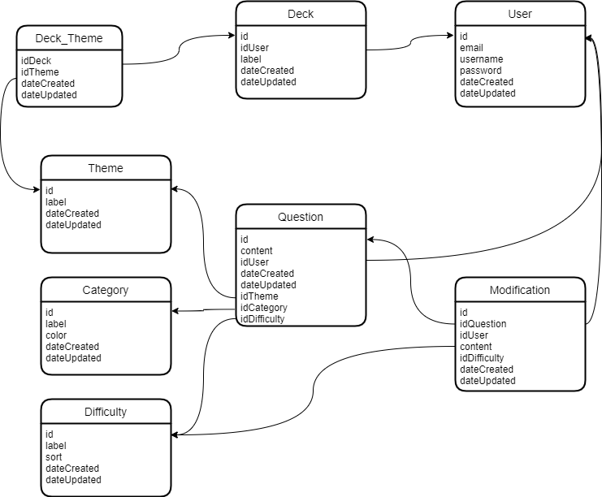

# Trivial code

[Source](http://asi.insa-rouen.fr/enseignement/siteUV/genie_logiciel/referentiel_qualite/dsl.plan_type.pdf)

## Introduction

### Purpose

This README describe the target of this project. Its audience should be developers who want to participate or non developers who want to comment the projet.

### Field of application

This project will be a website called Not So Trivia. It's a database of questions for the Trivial Pursuit game. Each question will have a theme (e.g : Star Wars, Football, Politics), a category (Genius edition categories : Geography, Divertissements, History, Art and Literature, Science and nature, Sports and Loisirs) and a difficulty. Users will be able to add questions, and to build a deck by choosing themes and difficulties minimum and maximum. Users will then be able to play the game using an original plateau. Users will be able to print cards or using the website on a PC or a mobile to access questions directly.

### Document Organisation

## Global description

Not So Trivia will be a website, accessible on a browser (PC or Mobile). Il will be compatible with all majors recent browsers.

The website will be hosted on a "classic" server (no cloud) and will use a relationnal database to store datas.

### Environment

This will be a standalone, classic web 2.0 website, not needing connection to another system.

### User interfaces

RAS, classic website

### Functionnalities

| Name         | Description                                                                                                                             |
| ------------ | --------------------------------------------------------------------------------------------------------------------------------------- |
| Consultation | Visitor will be able to access existing questions by themes / categories / difficulties                                                 |
| Creation     | Users will be able to add questions                                                                                                     |
| Edition      | Users will be able to edit questions, based on a wiki model (users can propose changes that must be accepted by the community)          |
| Deckbuilding | Users will be able to build decks of questions                                                                                          |
| Play         | Users will be able to use there decks to play a game of trivial pursuit, questions not repetiting themselves until all have been played |
| Print        | Users will have access to a PDF allowing them to print there decks                                                                      |

### User profils

| Name          | Description                                                                                           |
| ------------- | ----------------------------------------------------------------------------------------------------- |
| Visitor       | A user without an account who just want read some questions and understand the purpose of the website |
| User          | A user with an account and eventually questions and / or decks                                        |
| Administrator | A super user who have superior edition rights and ability to lock questions                           |

### Development constraints

The website should be hosted on a low cost server (no revenue from the website exploitation = not a lot of money to host it).

The front should be mobile and desktop compatible, with no degradation of experience for either interfaces.

### Hypothesis and dependencies

## Detailed specifications

### Use case

#### Consultation

#### Registration

#### Connection

#### Creation of question

#### Edition of question

#### Creation of a deck

#### Playing

#### Printing

### Constraints

#### History

Each question should have an history

### Database Schema

## Furnitures

## Annexes
